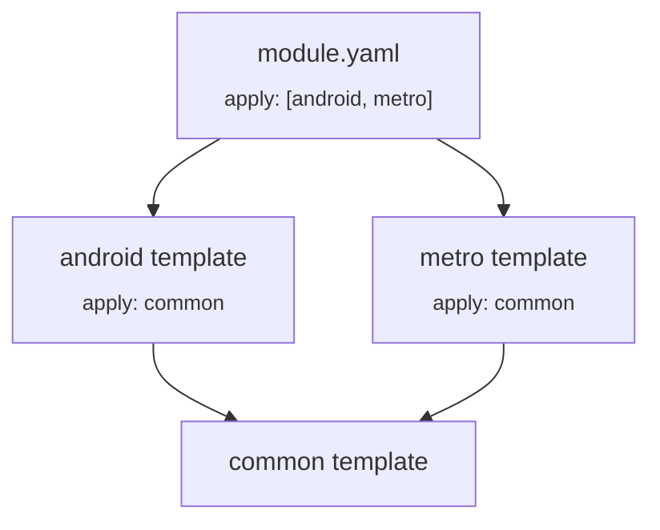

# Module Templates

Kotlin Toolchain `v0.12.0`.

Two things here are new in `0.12`: **nested templates** (a template applying another) and the **sibling-conflict**
rule. The merge rules themselves — scalars overridden, mappings and lists appended, `module.yaml` winning — already
worked the same way in `0.11.x`.

## Basics

A template file is named `<name>.module-template.yaml` and has the same structure as a `module.yaml`, with one
exception: it cannot contain a `product:` section. `@platform` qualifiers are supported.

Apply it from the `apply:` section. The path usually starts with `//` and is relative to the project root.

```yaml title="module.yaml"
product: jvm/app

apply:
  - //common.module-template.yaml

dependencies:
  - io.ktor:ktor-client:3.5.1
```

```yaml title="common.module-template.yaml"
repositories:
  - https://my.company/maven

settings:
  kotlin:
    version: 2.4.10
```

Effective configuration:

```yaml
product: jvm/app

repositories:
  - https://my.company/maven

dependencies:
  - io.ktor:ktor-client:3.5.1

settings:
  kotlin:
    version: 2.4.10
```

Read the merged result with:

```shell
kotlin show settings --module=my-module
```

Templates are the right home for anything shared: JDK version, Kotlin version, compiler arguments, repositories, and
publishing configuration.

## Nested Templates

A template can apply other templates through the same `apply:` section.

```yaml title="java.module-template.yaml"
settings:
  jvm:
    release: 11
```

```yaml title="spring.module-template.yaml"
apply:
  - //java.module-template.yaml

settings:
  springBoot: enabled
```

```yaml title="module.yaml"
product: jvm/app

apply:
  - //spring.module-template.yaml
```

Effective result: `jvm.release: 11` and `springBoot: enabled`.

## Precedence

Precedence is between whole files, not between individual sections. Where the `apply:` block sits inside a file does
not matter.

- `module.yaml` always beats every template it applies.
- A template beats the templates it applies, transitively.
- Two files where neither applies the other, even indirectly, are **siblings** and have no precedence over each other.

`module.yaml` and its templates form a graph through `apply:`. The effective configuration is built from the deepest
templates outward, merging level by level in topological order.



1. `common` is the starting point.
2. `android` and `metro` merge on top. Both beat `common`, but neither beats the other, so their order in the `apply:`
   list is irrelevant. If they set the same scalar to different values, that is a conflict.
3. `module.yaml` is applied last.

## Merging Rules

Same rules as platform-specific propagation in multiplatform modules:

- Scalars (strings, numbers, booleans) are **overridden** by the higher-precedence file.
- Lists are **concatenated**; mappings are **merged by key**. Two `settings:` blocks combine rather than one replacing
  the other — only conflicting scalar leaves fall back to precedence.

```yaml title="module.yaml"
product: jvm/app

apply:
  - //common.module-template.yaml

dependencies:
  - //jvm-util

settings:
  kotlin:
    version: 2.3.21
  jvm:
    release: 17
```

```yaml title="common.module-template.yaml"
dependencies:
  - //shared

settings:
  kotlin:
    version: 2.4.10
  compose: enabled
```

Effective:

```yaml
product: jvm/app

dependencies:      # lists appended
  - //shared
  - //jvm-util

settings:          # objects merged
  kotlin:
    version: 2.3.21  # module.yaml wins
  compose: enabled   # from the template
  jvm:
    release: 17      # from module.yaml
```

A template contributes **once**, no matter how many paths reach it. If `client` and `server` both apply `common`, and
`module.yaml` applies both, `common`'s dependencies appear a single time:

```yaml
dependencies:
  - //core-lib     # from common, added once
  - //client-lib
  - //server-lib
```

## Conflict Resolution

When two sibling templates set the same scalar to different values, the build fails.

```yaml title="java17-compatible.module-template.yaml"
settings:
  jvm:
    release: 17
```

```yaml title="java21-compatible.module-template.yaml"
settings:
  jvm:
    release: 21
```

```yaml title="module.yaml"
product: jvm/app

apply:
  - //java17-compatible.module-template.yaml
  - //java21-compatible.module-template.yaml

# Error: Conflicting values for property `release`
```

Two ways out.

**Set the value in the module.** It has precedence over both templates, so the conflict disappears:

```yaml title="module.yaml"
product: jvm/app

apply:
  - //java17-compatible.module-template.yaml
  - //java21-compatible.module-template.yaml

settings:
  jvm:
    release: 21
```

**Introduce a template that applies both and decides.** Use this when the resolution itself should be shared:

```yaml title="java-runtime-policy.module-template.yaml"
apply:
  - //java17-compatible.module-template.yaml
  - //java21-compatible.module-template.yaml

settings:
  jvm:
    release: 21
```

```yaml title="module.yaml"
product: jvm/app

apply:
  - //java-runtime-policy.module-template.yaml
```

`java-runtime-policy` applies both conflicting templates, so it has precedence over them and its value wins.

## Practical Notes

- Reordering entries in `apply:` never changes the result. If you were relying on order, the configuration is
  conflicting and should be resolved explicitly.
- A conflict is a build error, not a silent pick. Treat "conflicting values for property X" as a modelling question:
  which file should own that decision.
- Templates cannot declare `product:`, so a template can never make a module buildable on its own.
